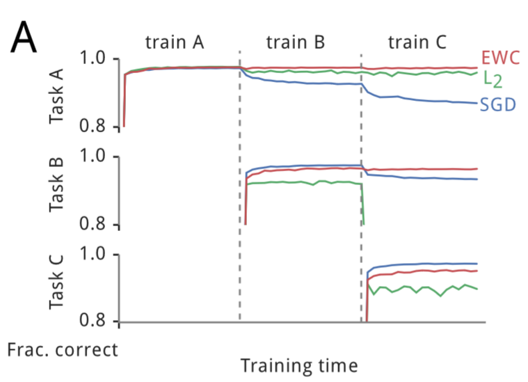
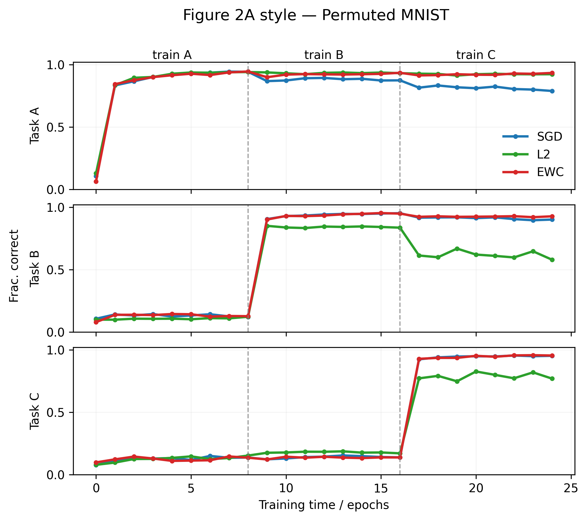
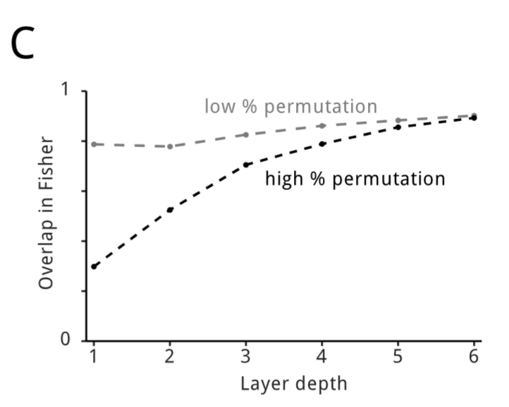
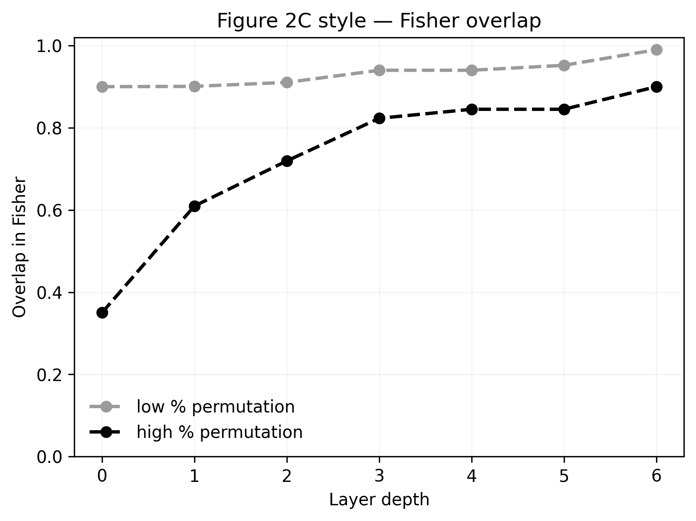
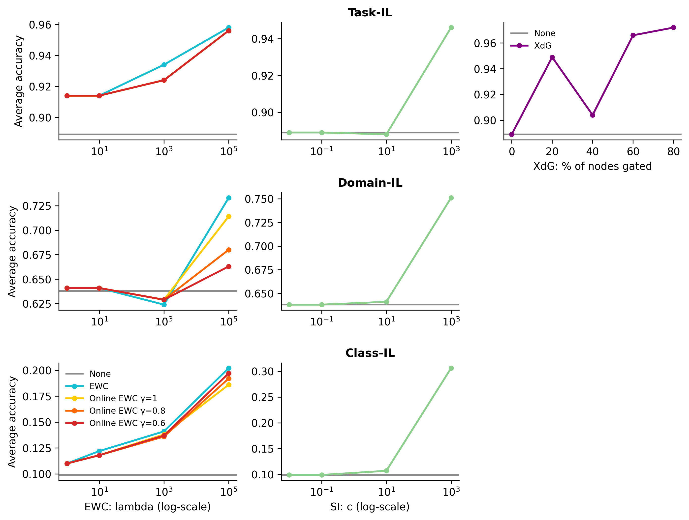
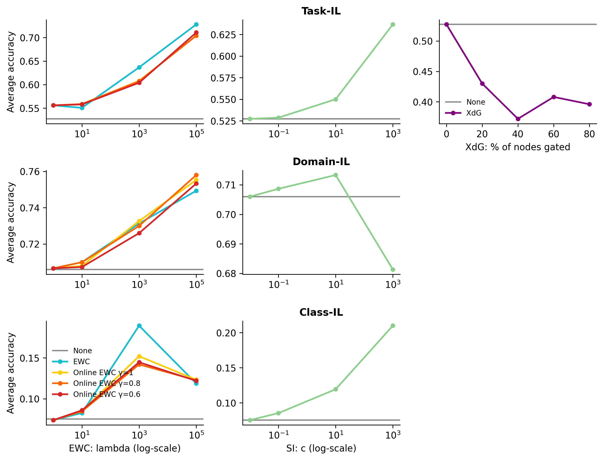

# Reproducibility Study: Overcoming Catastrophic Forgetting via Elastic Weight Consolidation (EWC)

[](https://www.python.org/downloads/)
[](https://pytorch.org/)

This repository contains a comprehensive reproducibility study and implementation of the **Elastic Weight Consolidation (EWC)** algorithm. The project evaluates the effectiveness of EWC in mitigating catastrophic forgetting within sequential learning environments.

## 📄 Primary Research Paper
* **Title:** [Overcoming catastrophic forgetting in neural networks](docs/Kirkpatrick_2017_Overcoming_Catastrophic_Forgetting.pdf)
* **Authors:** James Kirkpatrick, et al. (DeepMind)
* **Venue:** Proceedings of the National Academy of Sciences (PNAS), 2017

## 📚 Theoretical Framework and Secondary Sources
To provide a more rigorous evaluation, this study incorporates frameworks from the following secondary literature:
1. **Three Scenarios for Continual Learning** (van de Ven & Tolias, 2019): Categorization of experiments into Task-IL, Domain-IL, and Class-IL to identify the operational boundaries of EWC.
2. **Measuring Catastrophic Forgetting in Neural Networks** (Kemker et al., 2017): Implementation of standardized metrics to quantify retention and new knowledge acquisition.

---

## 🔬 Project Overview
Artificial Neural Networks typically suffer from **catastrophic forgetting**: when trained on a new task (Task B), the weights critical for a previous task (Task A) are modified, leading to an abrupt loss of prior expertise.

### The EWC Algorithm
Inspired by synaptic consolidation in biological brains, EWC selectively slows down the learning rate for weights identified as important to previous tasks.
* **Fisher Information Matrix:** The diagonal elements of the Fisher Information matrix are used to estimate the importance of each parameter to a task.
* **Elastic Constraint:** A quadratic penalty is added to the loss function during the training of subsequent tasks. This acts as a "spring" anchoring parameters to their previous optimal values, proportional to their importance.

---

## 🧪 Experimental Methodology & Architecture

### Hardware Constraints & The MNIST Pivot
While the original Kirkpatrick paper utilizes both MNIST and complex Atari 2600 environments, attempting to simulate and train RL agents on Atari environments proved too computationally expensive for standard personal hardware. Therefore, with formal approval, we pivoted our methodology to strictly utilize standard benchmarks that isolate the EWC variables without requiring server-farm compute power:

1. **Permuted MNIST:** The input pixels undergo a fixed random permutation for every new task.
2. **Split MNIST:** The model learns to classify subset pairs of digits sequentially (e.g., 0/1, then 2/3).

### Evaluated Scenarios (van de Ven & Tolias)
We analyze EWC performance across three distinct scenarios:
* **Task-Incremental Learning (Task-IL):** Task identity is provided during testing.
* **Domain-Incremental Learning (Domain-IL):** Task identity is unknown, but the structure of the task remains consistent.
* **Class-Incremental Learning (Class-IL):** The model must both infer task identity and classify the input, representing the most challenging scenario for EWC.

---

## 📊 Results & Visualizations

*(Below are comparisons of the original paper's findings versus our PyTorch reproduction)*

### 1. Training Curves (EWC vs. SGD vs. L2)
Our reproduction successfully demonstrates that standard SGD forgets Task A immediately upon learning Task B, whereas EWC maintains high accuracy for both.

| Original Paper (Figure 2A) | Our Reproduction |
|:---:|:---:|
|  |  |

### 2. Fisher Matrix Overlap
Demonstrating that different permutations rely on orthogonal parameter spaces.

| Original Paper (Figure 2C) | Our Reproduction |
|:---:|:---:|
|  |  |

### 3. Grid Search: Permuted & Split MNIST (van de Ven Scenarios)
Mapping the memory budget and hyperparameter sensitivities across Task-IL, Domain-IL, and Class-IL.

| Split MNIST Grid Search | Permuted MNIST Grid Search |
|:---:|:---:|
|  |  |

---

## 📁 Repository Structure

```text
EE-AI-Catastrophic-Forgetting-EWC/
│
├── src/                          # Jupyter Notebooks and source code
│   ├── kirkpatrick_ewc_reconstruction.ipynb
│   └── van_de_ven_three_scenarios.ipynb
│
├── results/                      # Generated graphs and CSV/Excel data dumps
│   ├── fig2A_training_curves.png
│   ├── fig2B_average_accuracy.png
│   ├── fig2C_fisher_overlap.png
│   ├── van_de_ven_figC_memory_budget.jpg
│   ├── van_de_ven_figD_permuted_gridsearch.jpg
│   ├── van_de_ven_figD_split_gridsearch.jpg
│   ├── van_de_ven_grid_search_matrix.csv
│   ├── van_de_ven_memory_budget_matrix.csv
│   ├── summary.json              # Runtime and metric summary data
│   └── all_matrices.xlsx         # Consolidated statistical results
│
├── docs/                         # Academic papers and reference images
│   ├── Kemker_2017_Measuring_Catastrophic_Forgetting.pdf
│   ├── Kirkpatrick_2017_Overcoming_Catastrophic_Forgetting.pdf
│   ├── VanDeVen_2019_Three_Scenarios_Continual_Learning.pdf
│   ├── EWC_Reconstruction_Explanation.pdf
│   ├── f תוכנית עבודה EWC-1.pdf
│   ├── original_fig2A.png        # Cropped from Kirkpatrick paper
│   └── original_fig2C.png        # Cropped from Kirkpatrick paper
│
├── takeaways.md                  # Project conclusions and math explanations (Hebrew)
├── AI_Usage.md                   # AI usage declaration and methodology (Hebrew)
├── requirements.txt              # Python environment dependencies
└── README.md                     # You are here
```
---
## 💻 Implementation Details & Setup
### Core Libraries Used

- Deep Learning: ```torch```, ```torchvision``` for model architecture and the EWC penalty loop.
- Visualization: ```matplotlib``` for generating reconstruction and penalty graphs.
- Data Handling: ```numpy```, ```pandas```, and ```openpyxl``` for matrix operations, grid search logs, and Excel workbook compilation.

### Prerequisites & Installation
To run this project locally, ensure you have Python 3.8+ installed.
1. Clone the repository:
   ```
    git clone [https://github.com/CARR0T404/EE-AI-Catastrophic-Forgetting-EWC.git](https://github.com/CARR0T404/EE-AI-Catastrophic-Forgetting-EWC.git)
    cd EE-AI-Catastrophic-Forgetting-EWC
    ```
 2. Install the required dependencies:
    ```
    pip install -r requirements.txt
    ```
---
## 📖 Extended Documentation
For a deep dive into our engineering conclusions, mathematical breakdowns, and our project management methodology, please refer to our extended Hebrew documentation:

- [Project Takeaways & Conclusions (תובנות ומסקנות)](takeaways.md)
- [AI Usage Declaration (הצהרת שימוש בבינה מלאכותית)](AI_Usage.md)
